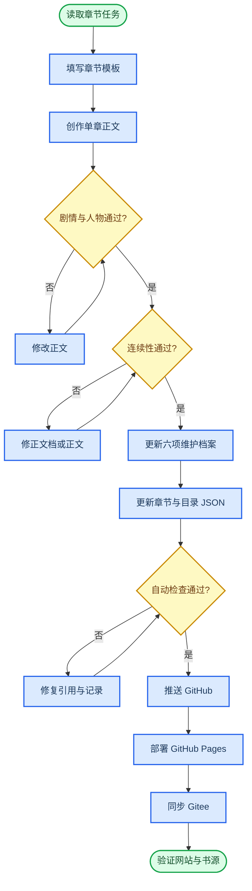

# 正式章节创作与发布流程

_规定单章从准备、写作、审查到网站和 Legado 发布的完整闭环；项目已进入正式连载阶段。_

---

## 🔄 单章生产流程



## 📋 阶段一：动笔前准备

1. 从 `docs/章节规划.md` 和详细场景卡确认本章主任务
2. 复制 `docs/章节创作模板.md` 的字段形成当章工作记录
3. 从 `docs/连续性台账.md` 读取上一章实际结束状态
4. 锁定本章允许新增的信息、伏笔和专业概念
5. 确认目标字数及各场景预算

第一卷前五章还必须对照 `docs/第一卷前五章写作任务书.md`。

## ✍️ 阶段二：单章创作与审查

正文一次只创作一章。初稿完成后依次进行：

### 剧情审查

- 主任务是否真正推进
- 场景是否都有状态变化
- 章尾钩子是否由本章因果产生
- 是否提前泄露后续答案

### 人物审查

- 陈默是否谨慎但有能力
- 配角是否拥有独立专业作用
- 人物是否使用了自己尚不知道的信息
- 感情线是否克制且不替代主线

### 专业与风格审查

- 专业概念是否通过现场问题被理解
- 技术判断是否改变行动或证据结论
- 笑点是否来自人物、流程和反差
- 危险、证据和情感场景是否保持认真

## 🗂️ 阶段三：同步维护档案

正文定稿后，在同一个提交中更新：

| 文件 | 必须记录 |
|---|---|
| `docs/章节摘要.md` | 实际事件、状态变化和下一章承接 |
| `docs/时间线.md` | 实际时间、地点、事件和后果 |
| `docs/人物状态.md` | 位置、权限、身体、已知信息和关系 |
| `docs/伏笔表.md` | 埋设、加深、回收或废弃状态 |
| `docs/连续性台账.md` | 权限、预算、证据、知识矩阵和完整章记录 |
| `docs/世界观规则.md` | 仅记录实际揭示或改变的关键规则 |

没有关键设定变化时，不必改写世界观正文，但必须在连续性台账中写“关键设定变化：无”。

前五项维护档案必须在本章记录附近加入 `<!-- chapter:volume-XX/chapter-XXX -->` 标记。自动检查据此确认每章完成了维护闭环；没有伏笔变化时，也要登记“本章检查，无状态变化”。

## 🌐 阶段四：生成网站数据

正式章节使用独立 JSON 文件，路径为：

`chapters/volume-XX/chapter-XXX.json`

同时更新：

- `data/catalog.json` 的卷内目录和扁平目录
- `data/book.json` 的最新章节、更新时间和连载阶段
- 章节条目的 Gitee Raw 固定地址

第一次正式发布时删除测试章，并把 `publicationStage` 改为 `serializing`。正式章与非正式测试章不得同时存在。

## ✅ 阶段五：测试与发布

发布前执行：

```text
npm test
```

测试通过后：

1. 提交并推送 GitHub `main`
2. 等待 GitHub Pages 工作流成功
3. 将同一 `main` 推送到 Gitee
4. 核对 GitHub 与 Gitee 提交编号一致
5. 检查网站首页、目录、正文页和 Gitee Raw 章节地址
6. 用 Legado 打开最新章节，确认标题、段落和上一章/下一章正常

## ⛔ 停止发布条件

遇到以下任一情况，不得发布：

- 正式章与测试章同时出现在目录
- 章节标题、编号、卷名或链接不一致
- 本章摘要、时间线、人物状态或连续性台账未更新
- 人物使用尚未获得的信息
- 权限额度和补丁有效期无法对账
- 伏笔状态与正文实际内容不一致
- 自动检查失败
- GitHub 与 Gitee 镜像内容不一致
